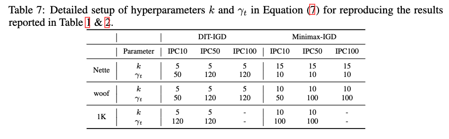

# Influence-Guided Diffusion for Dataset Distillation


This repo contains code for the ICLR 2025 submission "Influence-Guided Diffusion for Dataset Distillation". 


### Getting Started

First, create the conda virtual enviroment

```bash
conda env create -f enviroment.yaml
```

You can then activate your  conda environment with
```bash
source activate diff
```

Before start, please make sure the root to your ImageNet-1K dataset is:
```
../imagenet/
```

### Obtaining a well-trained model to calculate influence
Before starting distillation, you need to train a surrogate model on the original dataset by: 
```
bash ./train_ckpts.sh
```

This script will train one ConvNet-6 models on your target dataset (depicted by "spec") for 50 epochs. The well-trained model will store at ./ckpts/.

### Influence-Guided Sampling for DiT
Running the following sript will generate a IPC50 surrogate dataset for ImageWoof based on a pre-trained DiT with our IGD sampling method. 
```
bash sample_mp.sh
```
To reproduce the our result achieved with Minimax fine-tuning approch, you need to access the []official repo of Minimax and fine-tuning a DiT model under their guidance.  

### Training Models on the Generated Data
Please run the following script to train a ResNetAP-10 model on the generated dataset with 5 random seeds.
```
bash train.sh
```

Please use the following hyper-parameters to attain our results reported in Table 1 & 2 of the paper:
