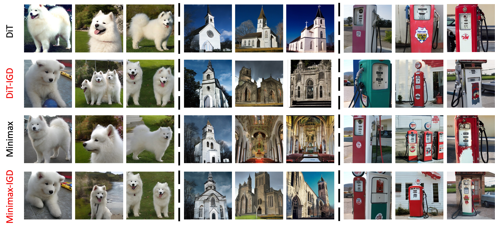
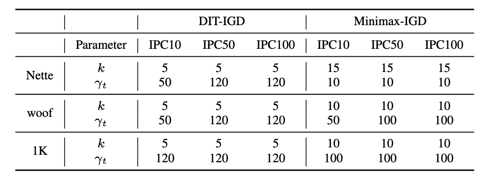

# Influence-Guided Diffusion for Dataset Distillation


This is the official implementation for the ICLR 2025 paper "[Influence-Guided Diffusion for Dataset Distillation](https://openreview.net/forum?id=0whx8MhysK)". 
<div align="center">
    
</div>

### Abstract
Dataset distillation refers to the task aims to streamline the training process by creating a compact yet effective dataset for a much larger original dataset. 

Motivated by the remarkable capabilities of **diffusion generative models in learning target dataset distributions** and controllably sampling high-quality data tailored to user needs, we propose framing dataset distillation as a controlled diffusion generation task aimed at **generating data specifically tailored for effective training purposes**. 

By establishing a correlation between the overarching objective of dataset distillation and the trajectory influence function ([TracIn](https://arxiv.org/abs/2002.08484)), we introduce the Influence-Guided Diffusion (IGD) sampling framework to generate training-effective data without the need to retrain diffusion models. 

An **influence guidance** function is designed by leveraging TracIn as an indicator to steer diffusions to produce data with influence promotion with a **deviation guidance** function for diversity enhancement. 

Extensive experiments show that our IGD method achieving state-of-the-art performance in distilling ImageNet datasets. 

### Getting Started

First, create the conda virtual enviroment

```bash
conda env create -f enviroment.yaml
```

You can then activate your  conda environment with
```bash
source activate diff
```

Before start, please make sure the root to your ImageNet-1K dataset is:
```
../imagenet/
```

### Obtaining a well-trained model to calculate influence
Before starting distillation, you need to train a surrogate model on the original dataset by: 
```
bash ./train_ckpts.sh
```

This script will train one ConvNet-6 models on your target dataset (depicted by "spec") for 50 epochs. The well-trained model will store at ./ckpts/.

### Influence-Guided Sampling for DiT
Running the following sript will generate a IPC50 surrogate dataset for ImageWoof based on a pre-trained [DiT](https://github.com/facebookresearch/DiT) with our IGD sampling method. 
```
bash sample_mp.sh
```
To reproduce the our result achieved with [Minimax](https://github.com/vimar-gu/MinimaxDiffusion) fine-tuning approch, you need to access the official repo of Minimax and fine-tuning a DiT model under their guidance.  

### Training Models on the Generated Data for Validation
Please run the following script to train a ResNetAP-10 model on the generated dataset with 5 random seeds.
```
bash train.sh
```

### Hyperparameters Setup
Please use the following hyperparameters to reproduce our results reported in Table 1 & 2 of the paper:
<div align="center">
  
</div>


### Citation
If you find our work useful for your research, please cite:
```
@inproceedings{
chen2025influenceguided,
title={Influence-Guided Diffusion for Dataset Distillation},
author={Mingyang Chen and Jiawei Du and Bo Huang and Yi Wang and Xiaobo Zhang and Wei Wang},
booktitle={The Thirteenth International Conference on Learning Representations},
year={2025},
url={https://openreview.net/forum?id=0whx8MhysK}
}
```

### Acknowledgements
This project is mainly developed based on the following works:
- [DiT](https://github.com/facebookresearch/DiT)
- [MinimaxDiffusion](https://github.com/vimar-gu/MinimaxDiffusion)
- [MTT](https://github.com/GeorgeCazenavette/mtt-distillation)
- [guided-diffusion](https://github.com/openai/guided-diffusion)
